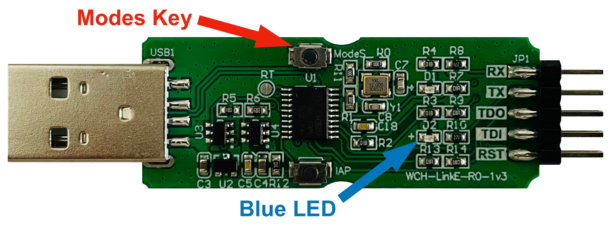

# CH32V003 Development Guide

- [CH32V003 Development Guide](#ch32v003-development-guide)
  - [Development Environments](#development-environments)
    - [Option 1 - MounRiver Studio](#option-1---mounriver-studio)
    - [Option 2 - ch32v003fun](#option-2---ch32v003fun)
      - [Compiling and Uploading (macOS)](#compiling-and-uploading-macos)
      - [Build `minichlink` Utility (macOS)](#build-minichlink-utility-macos)
      - [Unbrick CH32V003J4M6](#unbrick-ch32v003j4m6)
    - [Option 3 - PlatformIO](#option-3---platformio)
  - [Programming CH32V003](#programming-ch32v003)
    - [Wiring the CH32V003 to WCH-LinkE](#wiring-the-ch32v003-to-wch-linke)
    - [Switch WCH-LinkE to RISC-V Mode](#switch-wch-linke-to-risc-v-mode)
  - [References](#references)

## Development Environments

WCH usually does not provide good development support to macOS or Linux. Thanks for the open source world, there are always geeks that port the development environment. Kudos for you!

### Option 1 - MounRiver Studio

[MounRiver Studio](http://www.mounriver.com/) is the WCH official development environment. However, it only support Windows, so I never tried since I do not have a Windows environment.

### Option 2 - ch32v003fun

I started CH32V003 from  [Stefan Wagner's CH32V003 RISC-V Mini Game Console](https://github.com/wagiminator/CH32V003-GameConsole). It is a great experience to begin with Stefan's projects, as there are always clear guides and the projects are self-contained. I then moved to [CNLohr's ch32v003fun](https://github.com/cnlohr/ch32v003fun) as there are more examples.

#### Compiling and Uploading (macOS)

Install [RISC-V Toolchain](https://github.com/riscv-software-src/homebrew-riscv).

```shell
brew tap riscv-software-src/riscv
brew install riscv-tools
```

This project uses the `minichlink` utility to upload, so the `libusb` is required as a dependency.

```shell
brew install libusb
```

Clone the project, connect the board to the programmer, then run the `make` command to compile and upload the firmware.

```shell
git clone https://github.com/limingjie/CH32V003-ST7735-Driver.git
cd CH32V003-ST7735-Driver/Examples/DrawTest
make
```

#### Build `minichlink` Utility (macOS)

The `minichlink` utility in the `tools` library is built for `x86_64`. If your macOS runs on Apple Silicon, you can build the `minichlink` utility easily.

```shell
brew install pkg-config
brew install libusb
git clone https://github.com/cnlohr/ch32v003fun.git
cd ch32v003fun/minichlink
make
```

#### Unbrick CH32V003J4M6

The `PD1/SWDIO`, `PD4`, and `PD5` share the same pin on CH32V003J4M6. After the program uploaded, it is not possible to upload again. Use the `minichlink -u` command to clear all code flash (unbrick) and then upload.

```shell
minichlink -u
```

### Option 3 - PlatformIO

The [platform-ch32v](https://github.com/Community-PIO-CH32V/platform-ch32v) project provides PlatformIO support to CH32V serial of chips, follow the [documentation](https://pio-ch32v.readthedocs.io/en/latest/installation.html) to setup the environment.

The project seems directly use the WCH official header files. I tried port some code to the PlatformIO, and it is qute easy as long as I change the registers directly instead of calling the functions. There are some differences on macro names.

## Programming CH32V003

To program the CH32V003 microcontroller, you will need a programmer that supports SWD.

- The official [WCH-LinkE](https://www.wch-ic.com/products/WCH-Link.html) programmer.
- Check [CNLohr's ch32v003fun](https://github.com/cnlohr/ch32v003fun) project for other options, such as ESP32S2 and Arduino-based programmers.

### Wiring the CH32V003 to WCH-LinkE

| WCH-LinkE | CH32V003 |
| --------- | -------- |
| SWDIO     | SWIO     |
| GND       | GND      |
| 3V3       | VDD      |

### Switch WCH-LinkE to RISC-V Mode

If the blue LED on the WCH-LinkE is always on, it is in ARM mode. To program CH32V003, it needs to be in RISC-V mode. Hold the Modes key while plugging it in the USB port.



## References

- [Stefan Wagner: CH32V003 RISC-V Mini Game Console](https://github.com/wagiminator/CH32V003-GameConsole)
- [CNLohr: ch32v003fun](https://github.com/cnlohr/ch32v003fun)
- [RISC-V Software: homebrew-riscv](https://github.com/riscv-software-src/homebrew-riscv)
