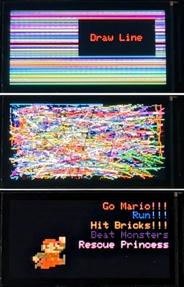

# CH32V003 ST7735 Driver

A minimal ST7735 LCD driver for CH32V003 that supports both [ch32v003fun](https://github.com/cnlohr/ch32v003fun) and [PlatformIO CH32V](https://github.com/Community-PIO-CH32V/platform-ch32v). It should also work in [MounRiver Stdio](http://www.mounriver.com/) (I do not have a Windows environment to validate, please let me know if it works).



- [CH32V003 ST7735 Driver](#ch32v003-st7735-driver)
  - [Usage](#usage)
    - [Wiring](#wiring)
    - [Initialization](#initialization)
    - [Text](#text)
    - [Drawing](#drawing)
  - [Configuration](#configuration)
    - [Change Resolution and Offset](#change-resolution-and-offset)
    - [RGB Color Macro](#rgb-color-macro)
    - [Set Rotation \& Color](#set-rotation--color)
    - [Invert Colors](#invert-colors)
  - [CH32V003 Development Guide](#ch32v003-development-guide)
  - [License](#license)
  - [References](#references)

## Usage

### Wiring

| CH32V003         | ST7735      | Power | Description                       |
| ---------------- | ----------- | ----- | --------------------------------- |
|                  | 1 - `LEDA`  | `3V3` | Use PWM to control brightness     |
|                  | 2 - `GND`   | `GND` | GND                               |
| `PC2`            | 3 - `RESET` |       | Reset                             |
| `PC3`            | 4 - `RS`    |       | DC (Data / Command)               |
| `PC6` (SPI MOSI) | 5 - `SDA`   |       | SPI MOSI (Master Output Slave In) |
| `PC5` (SPI SCLK) | 6 - `SCL`   |       | SPI SCLK (Serial Clock)           |
|                  | 7 - `VDD`   | `3V3` | VDD                               |
| `PC4`            | 8 - `CS`    |       | SPI CS/SS (Chip/Slave Select)     |

Note: To not use CS, define the `ST7735_NO_CS` macro in `st7735.h`. Make ST7735 always enabled by pulling CS to ground.

```C
#define ST7735_NO_CS
```

### Initialization

Include the header file.

```C
#include "st7735.h"
```

Then invoke `tft_init()` function to initialize the driver.

```C
tft_init();
```

### Text

Printing a string.

```C
tft_set_color(RED);
tft_set_background_color(BLACK);
tft_set_cursor(2, 2);
tft_print("Hello World!");
```

Printing a number.

```C
tft_set_color(RED);
tft_set_background_color(BLACK);
tft_set_cursor(2, 10);
tft_print_number(123);
tft_set_cursor(2, 20);
tft_print_number(-123);
```

### Drawing

Drawing a point.

```C
tft_draw_pixel(80, 30, RED);
```

Fill a rectangle area.

```C
tft_fill_rect(10, 10, 30, 30, BLUE);
```

## Configuration

Depends on which ST7735 variants you are using, it may have different configuration. You can configure the behavior in `st7735.h` or `st7735.c`.

### Change Resolution and Offset

```C
// st7735.h
#define ST7735_WIDTH    160
#define ST7735_HEIGHT   80
#define ST7735_X_OFFSET 1
#define ST7735_Y_OFFSET 26
```

### RGB Color Macro

```C
#define RGB565(r, g, b) ((((r)&0xF8) << 8) | (((g)&0xFC) << 3) | ((b) >> 3))
#define BGR565(r, g, b) ((((b)&0xF8) << 8) | (((g)&0xFC) << 3) | ((r) >> 3))
#define RGB             RGB565
```

### Set Rotation & Color

```C
// st7735.c
void tft_init(void)
{
    ...
    // Set rotation
    write_command_8(ST7735_MADCTL);
    write_data_8(ST7735_MADCTL_MY | ST7735_MADCTL_MV | ST7735_MADCTL_BGR);  // 0 - Horizontal
    // write_data_8(ST7735_MADCTL_BGR);                                        // 1 - Vertical
    // write_data_8(ST7735_MADCTL_MX | ST7735_MADCTL_MV | ST7735_MADCTL_BGR);  // 2 - Horizontal
    // write_data_8(ST7735_MADCTL_MX | ST7735_MADCTL_MY | ST7735_MADCTL_BGR);  // 3 - Vertical
    ...
}
```

### Invert Colors

```C
// st7735.c
void tft_init(void)
{
    ...
    // Invert display
    write_command_8(ST7735_INVON);
    // write_command_8(ST7735_INVOFF);
    ...
}
```

## CH32V003 Development Guide

[CH32V003 Development Guide](CH32V003_Dev_Guide.md)

## License

This work is licensed under a [Creative Commons Attribution-NonCommercial-ShareAlike 4.0 International License](https://creativecommons.org/licenses/by-nc-sa/4.0/).

## References

- [moononournation: Arduino_GFX](https://github.com/moononournation/Arduino_GFX)
- [Morita_Hikaru: CH32V003/Driver/CH32V003_LCD_Driver.zip](https://gitee.com/morita/ch32-v003/tree/master/Driver)
- [E. Brombaugh: SPI OLED demonstration](https://github.com/cnlohr/ch32v003fun/tree/master/examples/spi_oled)
